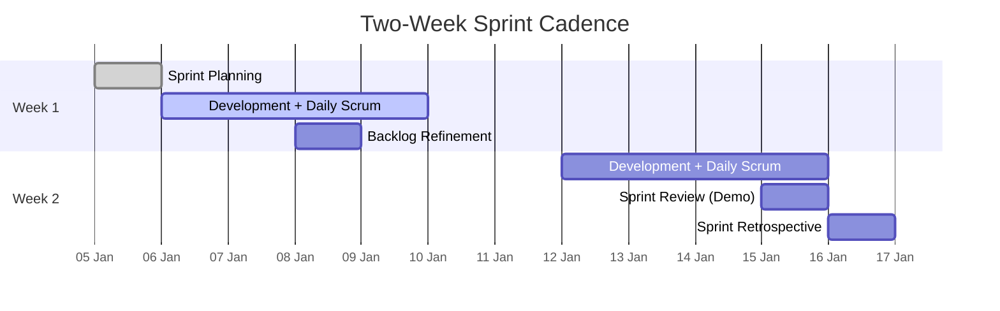

# AutoHub — Agile Scrum Sprint Plan

> Single source of truth: [`CANONICAL_SPEC.md`](../../CANONICAL_SPEC.md). This plan operationalizes the 6-sprint roadmap (S0–S5) defined there.

---

## 1. Cadence & Framework

AutoHub is delivered with **Scrum**, running **fixed 2-week sprints**. The team commits to a sprint goal, delivers a potentially shippable increment each sprint, and inspects/adapts through the standard ceremonies.

| Aspect | Convention |
| --- | --- |
| Sprint length | 2 weeks (10 working days) |
| Total roadmap | 6 sprints (S0–S5) ≈ 12 weeks |
| Working agreement | Definition of Ready before pull; [Definition of Done](./definition-of-done.md) before accept |
| Backlog IDs | Epics `EP-01…`, Stories `US-001…`, Test cases `TC-001…`, ADR `ADR-0001…` |
| Estimation | Story points (modified Fibonacci: 1, 2, 3, 5, 8, 13) |

### Ceremonies

| Ceremony | When | Timebox | Purpose |
| --- | --- | --- | --- |
| **Sprint Planning** | Day 1 | 4 h | Agree sprint goal, pull stories, break into tasks |
| **Daily Scrum** | Daily | 15 min | Sync progress, surface blockers |
| **Backlog Refinement** | Mid-sprint (Day 3–4) | 1–2 h | Groom & estimate upcoming stories, keep 1–2 sprints ready |
| **Sprint Review** | Day 9 | 2 h | Demo increment to stakeholders, gather feedback |
| **Sprint Retrospective** | Day 10 | 1.5 h | Inspect process, agree improvement actions |

### Roles

| Role | Responsibility |
| --- | --- |
| Product Owner | Owns backlog priority, accepts stories, guards vision |
| Scrum Master | Facilitates ceremonies, removes impediments, guards process |
| Dev Team | Backend (Java 21 / Spring Boot), Web-app & Control-panel (React/Bootstrap), QA, DevOps |

---

## 2. Sprint-by-Sprint Plan

Each sprint below references Epics/Stories generically (`EP-xx` / `US-xxx`) since the detailed backlog lives in [`docs/product`](../product/). Sprint goals and scope are fixed by the canonical spec.

### S0 — Foundation

| Field | Detail |
| --- | --- |
| **Goal** | Stand up the monorepo, local infrastructure, CI, an auth skeleton, and the design system so every downstream sprint has a paved road. |
| **Epics / Stories** | `EP-00 Platform Foundation` → `US-001` repo scaffold & conventions, `US-002` docker-compose (Postgres 16, Kafka KRaft, Adminer), `US-003` Postgres init & Flyway baseline, `US-004` backend Clean-Architecture skeleton, `US-005` web-app Vite/React scaffold, `US-006` control-panel scaffold, `US-007` docs set (product/architecture/agile/design), `US-008` CI pipeline. |
| **Deliverables** | Monorepo (`/backend`, `/web-app`, `/control-panel`, `/docs`, `/db/init`), `docker-compose.yml`, `.env.example`, `Makefile`, DB init SQL for the 4 environment databases, Spring Boot skeleton with bounded-context packages, two React apps booting, design system + UX docs, green CI. |
| **Definition of Done** | `docker compose up` brings the full stack healthy; both apps serve a landing page; backend `/actuator/health` = UP; Flyway baseline applies to `AutomobilesDB_Dev`; CI runs lint + build + test on every push; docs published. |

### S1 — Identity & RBAC

| Field | Detail |
| --- | --- |
| **Goal** | Users can sign up, log in, and be authorized by role; admins can manage users and CRUD all Masters. |
| **Epics / Stories** | `EP-01 Identity & Access` → `US-0xx` signup, login (JWT), logout/refresh, password policy, role assignment; `EP-02 RBAC` → permission model (`resource:action`), route/method guards; `EP-03 Masters` → CRUD for Make/Model/Variant/Fuel/Body/Transmission/Category/Location/Currency/Tour Category/Review Tag/Report Reason/Role/Permission. |
| **Deliverables** | `identity` context (domain + application + infra + interfaces), auth REST API, RBAC enforcement filter, user-management screens (control-panel), Masters CRUD screens, `identity.user.registered` domain event → Outbox → Kafka. |
| **Definition of Done** | Auth flows pass integration tests; 8 fixed roles seeded; permission checks enforced server-side; Masters CRUD works with validation; event published & consumed; accessibility AA on forms. |

### S2 — Catalog

| Field | Detail |
| --- | --- |
| **Goal** | Members create, edit, and browse rich car & bike posts with up to 20 validated images. |
| **Epics / Stories** | `EP-04 Catalog` → `US-0xx` create post, rich-text body (react-quill), edit/delete, list & detail, filter by Master attributes; `EP-05 Media` → 20-image uploader, type/size/resolution validation, gallery. |
| **Deliverables** | `catalog` + `media` contexts, post REST API, image upload endpoint with DTO validators (JPEG/PNG/WEBP, ≤5 MB, ≥640×480, max 20), web-app create/edit/detail pages, image gallery component, `catalog.post.published` & `media.image.uploaded` events. |
| **Definition of Done** | Post CRUD + image rules enforced with clear validation errors; gallery responsive; rich text sanitized (XSS-safe); events emitted; TC-suite green. |

### S3 — Engagement

| Field | Detail |
| --- | --- |
| **Goal** | Community can review and comment on posts, with moderation tooling. |
| **Epics / Stories** | `EP-06 Reviews` → star rating + review tags, one review per user per post; `EP-07 Comments` → threaded comments, edit/delete; `EP-08 Moderation` → report reasons, moderator queue, hide/remove. |
| **Deliverables** | `engagement` context, reviews & comments REST API, moderation screens (control-panel), report flow (web-app), `engagement.review.added` event. |
| **Definition of Done** | Review/comment CRUD + rules enforced; moderator can action reported content; audit trail written; notifications/events emitted; a11y for interactive lists. |

### S4 — Marketplace & KYC

| Field | Detail |
| --- | --- |
| **Goal** | Sellers list vehicles for sale after KYC; buyers browse & enquire; admins approve listings & KYC. |
| **Epics / Stories** | `EP-09 Marketplace` → create listing, price/currency, buyer enquiry, listing lifecycle (draft→pending→approved→sold); `EP-10 KYC` → seller/buyer KYC submission, document upload, `kyc:review` approval; `EP-11 Approvals` → admin approval queues. |
| **Deliverables** | `marketplace` context + KYC in `identity`, listing REST API, KYC workflow, approval screens, role-based badges (KYC status), `marketplace.listing.created` event. |
| **Definition of Done** | KYC gates listing creation; approval workflow enforced; listing state machine correct; currency from Masters; secure document handling; events emitted; security review passed. |

### S5 — Travel & Community

| Field | Detail |
| --- | --- |
| **Goal** | Authors publish travel blogs & tour guides; members form groups, follow, and see feeds. |
| **Epics / Stories** | `EP-12 Travel` → travel blog posts, tour categories, tour-guide listings; `EP-13 Community` → groups, follows, activity feed. |
| **Deliverables** | `travel` + `community` contexts, travel/tour REST API, blog editor (rich text + images), group & follow features, personalized feed, public web-app pages. |
| **Definition of Done** | Blog & tour publish flow works; groups/follows/feed functional; feed performance within budget; SEO/meta on public pages; full regression green; release candidate tagged. |

---

## 3. Velocity & Capacity

Velocity is **empirical** — it is measured, not promised. Use the rolling average of the last 3 sprints once available; until then plan from capacity.

**Capacity model (per sprint, illustrative baseline team of 5 devs):**

| Input | Value |
| --- | --- |
| Devs available | 5 |
| Working days / sprint | 10 |
| Ideal hours / dev / day | 6 (focus factor 0.75 of 8h) |
| Gross capacity | 5 × 10 × 6 = **300 h** |
| Ceremony / overhead deduction | ~15% |
| Net dev capacity | **~255 h** |
| Planning velocity (assumed) | **~34 story points** (calibrate after S1) |

Guidelines:
- Do **not** commit beyond the average velocity of the last 3 completed sprints (once history exists).
- Reserve ~10–15% capacity for bug-fix, tech-debt, and unplanned support.
- Re-forecast the release plan at each Sprint Review using actual velocity.

---

## 4. Release Plan

Incremental releases; each sprint ends with a potentially shippable increment. Public GA targeted after S5.

| Release | Sprint(s) | Theme | Key Capabilities | Env promotion |
| --- | --- | --- | --- | --- |
| **v0.1 Foundation** | S0 | Paved road | Infra, CI, auth skeleton, design system | Dev |
| **v0.2 Identity** | S1 | Access & Masters | Signup/login, RBAC, user mgmt, Masters CRUD | Dev → QA |
| **v0.3 Catalog** | S2 | Content | Car/bike posts, rich text, 20-image upload | QA |
| **v0.4 Engagement** | S3 | Community interaction | Reviews, comments, moderation | QA → UAT |
| **v0.5 Marketplace** | S4 | Commerce | Listings, buyer/seller KYC, approvals | UAT |
| **v1.0 GA** | S5 | Full platform | Travel blog, tour guide, groups, feeds | UAT → PROD |

Environments map to the fixed databases: `AutomobilesDB_Dev` → `AutomobilesDB_QA` → `AutomobilesDB_UAT` → `AutomobilesDB_PROD`.

> **Security note:** the DB password is committed only for local/dev convenience per the canonical spec. Production **must** source credentials from a secrets manager — never from committed config.

---

## 5. Backlog Flow & Definition of Ready

A story is **Ready** to be pulled into a sprint when it has: a clear `As a / I want / so that`, Acceptance Criteria (Given/When/Then), linked test cases (`TC-xxx`), noted edge cases, an estimate, and no unresolved dependencies. Acceptance uses the shared [Definition of Done](./definition-of-done.md). Live status is tracked in the [Progress Tracker](./progress-tracker.md).
