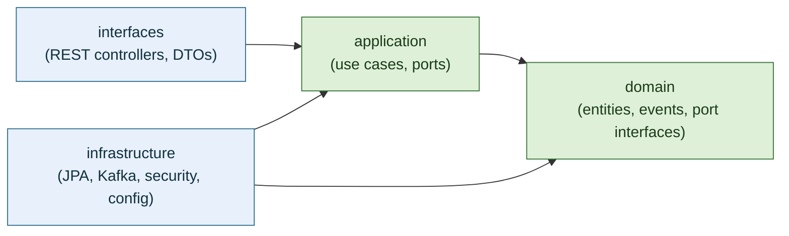
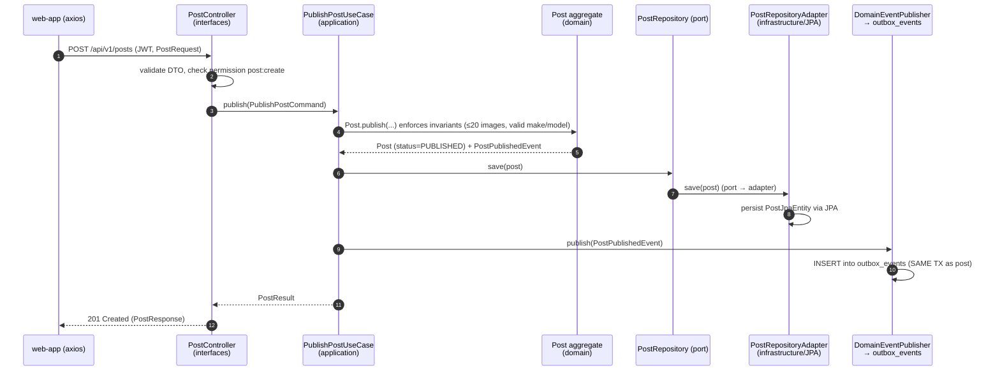

# Clean Architecture

The AutoHub backend follows **Clean Architecture** (a.k.a. Hexagonal / Ports & Adapters). The
codebase is organized by **bounded context** first, then by **architectural layer** inside each
context. This document explains the layering, the dependency rule, ports & adapters, the
bounded contexts, the package structure, and traces a concrete use case through the layers.

The decision and its rationale are recorded in [ADR-0002](adr/0002-clean-architecture.md).

## 1. The Layers

Each bounded context is layered identically:

| Layer | Responsibility | May import | Framework allowed? |
|-------|----------------|-----------|--------------------|
| `domain` | Entities, value objects, domain events, repository **port** interfaces, domain services, invariants. | Nothing (only JDK + other domain types). | **No** — pure Java. |
| `application` | Use cases (command/query handlers), application services, port interfaces (driven ports), event handlers, orchestration and transaction boundaries. | `domain`. | Minimal (e.g. `@Transactional`); no persistence/web details. |
| `infrastructure` | Adapters that **implement** driven ports: JPA repositories, Kafka publisher, security, config, Outbox relay. | `application`, `domain`. | Yes (Spring, JPA, Kafka). |
| `interfaces` | Driving adapters: REST controllers, DTOs, request/response mappers (web adapter). | `application`, `domain`. | Yes (Spring Web). |

## 2. The Dependency Rule

Source-code dependencies point **inward only**. Inner layers know nothing about outer layers.

```
interfaces  ─▶  application  ─▶  domain  ◀─  infrastructure
```

- `interfaces → application → domain`
- `infrastructure → application` and `infrastructure → domain`
- `domain` depends on **nothing** (no Spring, no JPA, no Kafka, no web).



The arrows above are **compile-time** dependencies. At **runtime**, control flows inward through
a driving adapter (a controller calls a use case) and outward through a driven adapter (a use
case calls a port, whose implementation lives in `infrastructure`). The dependency inversion
happens because the port **interface** is declared in an inner layer while its **implementation**
lives in `infrastructure`.

## 3. Ports & Adapters

- **Driving (inbound) ports** — the use-case interfaces in `application`. Driving adapters
  (REST controllers in `interfaces`) call them.
- **Driven (outbound) ports** — interfaces declared in `domain` (repositories) or `application`
  (e.g. `DomainEventPublisher`, `FileStoragePort`). Driven adapters in `infrastructure`
  implement them (JPA repository, Kafka publisher, object-store client).

This inverts the dependency: business logic depends on an **abstraction it owns**, and
infrastructure conforms to it. Swapping PostgreSQL, the message broker, or the file store means
writing a new adapter — no change to `domain`/`application`.

Key ports in AutoHub:

| Port (interface) | Declared in | Adapter (implementation) in |
|------------------|-------------|-----------------------------|
| `PostRepository` | `catalog.domain` | `catalog.infrastructure` (JPA) |
| `DomainEventPublisher` | `application` (shared) | `infrastructure` (writes `outbox_events`) |
| `ImageStoragePort` | `media.application` | `media.infrastructure` (object store) |
| `KycReviewRepository` | `identity.domain` | `identity.infrastructure` (JPA) |

## 4. Bounded Contexts

Base package: `com.autohub`. Eight contexts, each an independent slice with its own layers.

| Context | Package | Responsibility |
|---------|---------|----------------|
| Identity | `com.autohub.identity` | Auth, users, RBAC (roles/permissions), KYC. |
| Catalog | `com.autohub.catalog` | Car/bike posts. |
| Media | `com.autohub.media` | Image uploads (20-image rule, validation). |
| Engagement | `com.autohub.engagement` | Reviews & comments. |
| Marketplace | `com.autohub.marketplace` | Listings, buyer/seller, offers. |
| Travel | `com.autohub.travel` | Travel blog posts, tours / tour-guide. |
| Community | `com.autohub.community` | Groups, memberships, follows, feeds. |
| Adminops | `com.autohub.adminops` | Masters, audit log, reports. |

Contexts communicate **synchronously** only through published application interfaces where
strictly necessary, and preferentially **asynchronously** via domain events on Kafka (see
[event-driven-architecture.md](event-driven-architecture.md)). This keeps contexts loosely
coupled and independently evolvable.

## 5. Package Structure

```
com.autohub
├── shared
│   ├── domain            # base Entity, AggregateRoot, DomainEvent, ValueObject
│   ├── application        # DomainEventPublisher port, Command/Query, Result
│   └── infrastructure     # OutboxEventEntity, OutboxRelay, JWT, config
│
├── catalog
│   ├── domain
│   │   ├── model          # Post (aggregate root), PostImageRef (VO), PostStatus (enum)
│   │   ├── event          # PostPublishedEvent
│   │   └── port           # PostRepository (driven port interface)
│   ├── application
│   │   ├── command        # PublishPostCommand
│   │   ├── usecase        # PublishPostUseCase (driving port) + impl service
│   │   └── handler        # event handlers (e.g. on media.image.uploaded)
│   ├── infrastructure
│   │   ├── persistence    # PostJpaEntity, PostJpaRepository, PostRepositoryAdapter
│   │   └── config         # context wiring
│   └── interfaces
│       └── rest           # PostController, PostRequest/PostResponse DTOs, PostMapper
│
├── identity   (domain | application | infrastructure | interfaces)
├── media      (domain | application | infrastructure | interfaces)
├── engagement (domain | application | infrastructure | interfaces)
├── marketplace(domain | application | infrastructure | interfaces)
├── travel     (domain | application | infrastructure | interfaces)
├── community  (domain | application | infrastructure | interfaces)
└── adminops   (domain | application | infrastructure | interfaces)
```

The same four-layer tree repeats inside every context, so the structure is predictable and
enforceable (e.g. by ArchUnit tests asserting the dependency rule).

## 6. Worked Example — "Publish a car post"

Use case: an authenticated Seller/Author publishes a car post with rich-text body and up to 20
images.



Tracing the layers:

1. **interfaces** — `PostController` receives the HTTP request, binds/validates the
   `PostRequest` DTO, verifies the caller holds `post:create`, maps to a `PublishPostCommand`,
   and invokes the driving port `PublishPostUseCase`. It knows nothing about JPA or Kafka.
2. **application** — `PublishPostUseCase` opens the transaction, loads referenced Masters if
   needed, tells the **domain** aggregate to publish, calls the `PostRepository` port to persist,
   and calls the `DomainEventPublisher` port to record the event. It orchestrates but contains no
   persistence/web code.
3. **domain** — `Post.publish(...)` enforces business invariants (max 20 images; make/model/
   variant must be consistent; body must be present) and emits `PostPublishedEvent`. Pure Java.
4. **infrastructure** — `PostRepositoryAdapter` implements `PostRepository` via JPA; the
   `DomainEventPublisher` adapter writes an `outbox_events` row in the same transaction. Later
   the Outbox relay publishes it to Kafka topic `catalog.post.published`.

Because the domain and application layers depend only on **ports**, the entire use case is unit-
testable with in-memory fakes and no Spring context.

## Related Documents

- [overview.md](overview.md)
- [event-driven-architecture.md](event-driven-architecture.md)
- [ADR-0002 Clean Architecture](adr/0002-clean-architecture.md)
