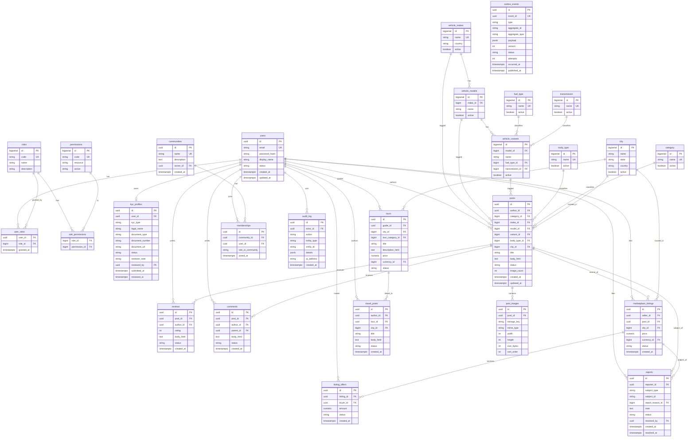

# Data Model & ERD

This document describes the AutoHub relational data model on **PostgreSQL 16**. The schema is
owned by role `automobiles`, versioned with **Flyway** (see [ADR-0005](adr/0005-postgres-flyway.md)),
and identical across the four environment databases (`AutomobilesDB_Dev`, `_QA`, `_UAT`,
`_PROD`).

Conventions: surrogate primary keys (`UUID` for user-generated aggregates, `BIGSERIAL` for
master/lookup tables), `created_at` / `updated_at` audit columns on mutable tables, and soft
deletes where content moderation requires history.

## Entity–Relationship Diagram

> Mermaid `erDiagram` shows only a curated subset of foreign keys as explicit relationships for
> readability; every `*_id FK` column above is a foreign key at the database level, and the
> master tables (`report_reason`, `currency`, `tour_category`, `review_tag`) referenced by
> `reports`, `marketplace_listings`, `tours` and reviews follow the same `bigserial id PK` /
> `active` lookup shape shown for `fuel_type` etc.

## Table Descriptions

### Identity & RBAC

| Table | Description |
|-------|-------------|
| `users` | Registered accounts. Holds email (unique), bcrypt `password_hash`, display name and account `status`. Root of most content aggregates. |
| `roles` | RBAC roles. `code` is one of the fixed set (SUPER_ADMIN, ADMIN, MODERATOR, SELLER, BUYER, AUTHOR, MEMBER, GUEST). |
| `permissions` | Fine-grained permissions in `resource:action` form (e.g. `post:create`). `resource` and `action` are also stored split for querying. |
| `role_permissions` | Many-to-many join between roles and permissions. Defines what each role can do. |
| `user_roles` | Many-to-many join granting roles to users, with `granted_at`. |
| `kyc_profiles` | One KYC dossier per user (buyer or seller). Holds legal name, document type/number/URL, and the review state machine (`status`: DRAFT/SUBMITTED/UNDER_REVIEW/APPROVED/REJECTED) plus reviewer note and reviewer id. |

### Vehicle Reference (car/bike taxonomy)

| Table | Description |
|-------|-------------|
| `vehicle_makes` | Manufacturers (e.g. Toyota, Honda). Master data. |
| `vehicle_models` | Models under a make (FK `make_id`). |
| `vehicle_variants` | Variants/trims under a model (FK `model_id`), classified by `fuel_type` and `transmission`. |

### Content — Catalog & Engagement

| Table | Description |
|-------|-------------|
| `posts` | Car/bike posts. References taxonomy (make/model/variant/body_type/category), `city`, author, rich-text `body_html`, moderation `status`, and a denormalized `image_count` (≤20). |
| `post_images` | Images attached to a post. Stores object-store `storage_key`, `mime_type`, `width`/`height`, `size_bytes`, `sort_order`. Enforces upload rules at write time. |
| `reviews` | Ratings + rich-text reviews on a post. `rating` 1–5. Moderatable `status`. |
| `comments` | Threaded comments on a post (`parent_id` self-reference). Requires a signed-in account. Moderatable `status`. |

### Marketplace

| Table | Description |
|-------|-------------|
| `marketplace_listings` | A for-sale listing, usually derived from a `post`. Seller must have APPROVED KYC. Holds `price`, `currency`, `city`, and `status` (DRAFT/PENDING/APPROVED/SOLD/REJECTED). |
| `listing_offers` | Buyer offers against a listing. Holds `amount` and negotiation `status`. |

### Travel & Community

| Table | Description |
|-------|-------------|
| `travel_posts` | Travel blog entries, optionally linked to a `tour`, located in a `city`. |
| `tours` | Tour-guide offerings by a guide user, with `tour_category`, `city`, `price`/`currency`, and `status`. |
| `communities` | Community groups with an owner. |
| `memberships` | Join between users and communities, with a per-community role. |

### Masters (lookup tables)

| Table | Description |
|-------|-------------|
| `fuel_type` | Petrol, Diesel, Electric, Hybrid, CNG, … |
| `body_type` | Sedan, SUV, Hatchback, Cruiser, Sport, … |
| `transmission` | Manual, Automatic, CVT, DCT, … |
| `category` | Top-level category: `car` or `bike`. |
| `city` | Cities with state/country, used across posts, listings and tours. |

(Additional master tables — `currency`, `tour_category`, `review_tag`, `report_reason` — plus
`roles`/`permissions` are also managed as Masters in the control-panel.)

### Platform / Cross-cutting

| Table | Description |
|-------|-------------|
| `outbox_events` | Transactional Outbox. One row per domain event written in the same TX as the business change; relayed to Kafka. Holds the full envelope (`event_id`, `type`, `aggregate_id`, `payload` JSONB, `version`) and relay state (`status`, `attempts`, `published_at`). See [event-driven-architecture.md](event-driven-architecture.md). |
| `audit_log` | Immutable record of security-relevant and admin actions: actor, action, target entity, JSON details, IP, timestamp. See [security-kyc.md](security-kyc.md#audit-logging). |
| `reports` | User-filed reports against content (post/listing/comment/review). References a `report_reason` master and tracks resolution. |

## Related Documents

- [overview.md](overview.md)
- [event-driven-architecture.md](event-driven-architecture.md)
- [rbac.md](rbac.md)
- [ADR-0005 PostgreSQL + Flyway](adr/0005-postgres-flyway.md)
