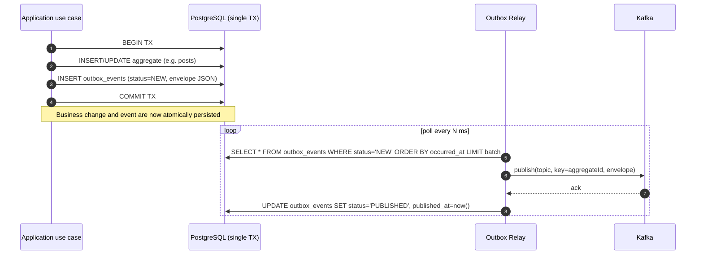
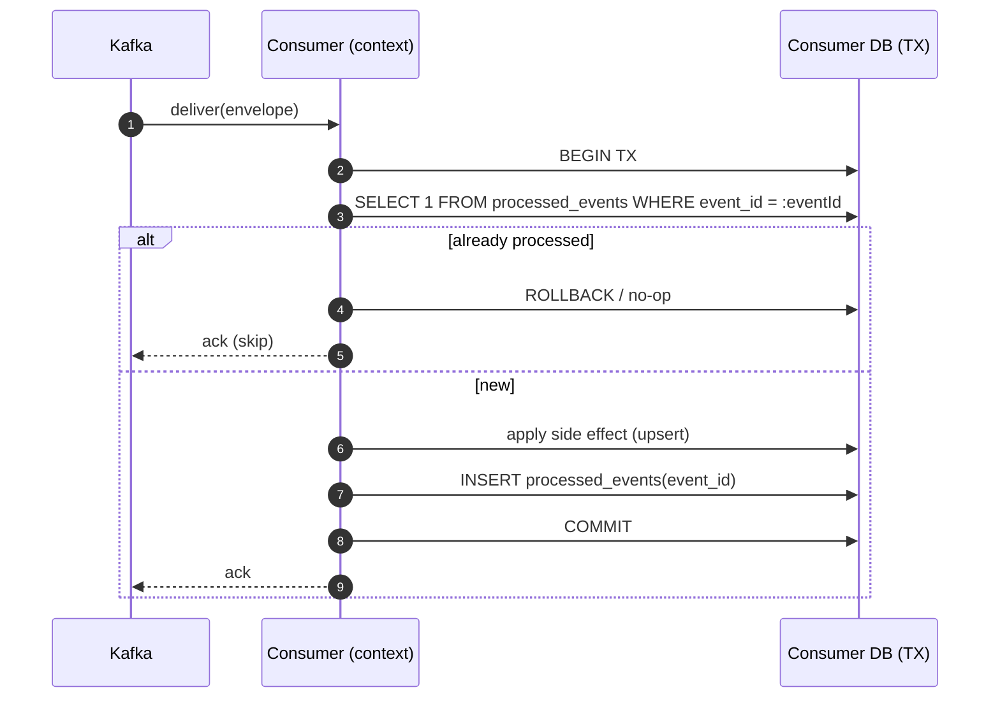
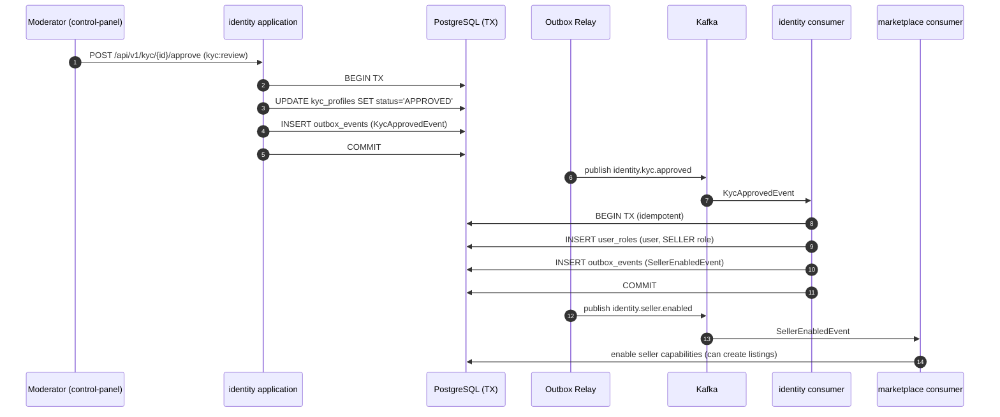

# Event-Driven Architecture

AutoHub uses domain events to decouple bounded contexts and to achieve eventual consistency
across the platform. Events are produced reliably using the **transactional Outbox** pattern and
distributed over **Apache Kafka** (KRaft mode, single broker). This document covers domain
events, the Outbox pattern, the Outbox relay, the topic list, the event envelope, idempotent
consumers, delivery semantics, eventual consistency, and a saga example.

The decision and its rationale are recorded in [ADR-0003](adr/0003-event-driven-outbox.md).

## 1. Domain Events

A **domain event** is an immutable fact about something that happened inside a bounded context
(past tense). Domain aggregates raise events; the application layer collects them and hands them
to the `DomainEventPublisher` port.

| Event | Raised by | Meaning |
|-------|-----------|---------|
| `UserRegisteredEvent` | identity | A new account was created. |
| `PostPublishedEvent` | catalog | A car/bike post was published. |
| `ListingCreatedEvent` | marketplace | A marketplace listing was created. |
| `ReviewAddedEvent` | engagement | A review was added to a post/listing. |
| `ImageUploadedEvent` | media | An image passed validation and was stored. |
| `KycApprovedEvent` | identity | A KYC profile reached the APPROVED state. |
| `SellerEnabledEvent` | identity/marketplace | A user was granted the SELLER role. |

## 2. Transactional Outbox Pattern

Publishing to Kafka and committing to PostgreSQL are two separate systems. Doing both naively
risks a **dual-write** inconsistency (DB commits but broker publish fails, or vice versa). The
Outbox pattern removes this risk: the event is written to an `outbox_events` table **in the same
local transaction** as the business change. Publishing to Kafka happens later, from that table.



The `outbox_events` table schema is defined in [data-model-erd.md](data-model-erd.md#outbox_events).

## 3. Outbox Relay to Kafka

The **Outbox relay** is an infrastructure component that:

1. Polls `outbox_events` for rows with `status = 'NEW'`, ordered by `occurred_at`, in bounded
   batches.
2. Publishes each row's envelope to the Kafka topic named by its `type`, using `aggregate_id`
   as the **partition key** (guarantees per-aggregate ordering).
3. On broker ack, marks the row `PUBLISHED` (sets `published_at`).
4. On failure, leaves the row `NEW` (and increments an attempt counter); it is retried on the
   next poll. This yields **at-least-once** publishing.

Because the relay may publish a row and crash before marking it `PUBLISHED`, the same event can
be published more than once. Consumers therefore must be **idempotent** (see §6).

## 4. Kafka Topics

The following topics are defined for AutoHub. Topic name equals the event `type`. Messages are
keyed by `aggregateId`.

| Topic | Producer context | Typical consumers |
|-------|------------------|-------------------|
| `identity.user.registered` | identity | community (create profile/feed), adminops (audit) |
| `catalog.post.published` | catalog | community (feeds), engagement (init counters), adminops (audit) |
| `marketplace.listing.created` | marketplace | community (feeds), adminops (moderation queue) |
| `engagement.review.added` | engagement | catalog (rating rollup), adminops (moderation) |
| `media.image.uploaded` | media | catalog (attach image to post), adminops (audit) |

## 5. Event Schema / Envelope

Every event is serialized to a common JSON envelope. The domain-specific data lives in
`payload`; envelope fields are stable across all topics.

| Field | Type | Description |
|-------|------|-------------|
| `eventId` | UUID | Unique per event instance; used by consumers for de-duplication. |
| `type` | string | Event/topic name, e.g. `catalog.post.published`. |
| `aggregateId` | UUID/string | Identifier of the aggregate; used as the Kafka partition key. |
| `occurredAt` | ISO-8601 timestamp | When the fact occurred (business time). |
| `payload` | object | Event-specific data. |
| `version` | integer | Schema version of `type` (enables schema evolution). |

Example envelope (`catalog.post.published`):

```json
{
  "eventId": "8f14e45f-ceea-467e-9a1c-9b2d3e4f5a6b",
  "type": "catalog.post.published",
  "aggregateId": "b2c3d4e5-0000-4a1b-8c2d-1122334455aa",
  "occurredAt": "2026-07-22T09:41:12Z",
  "version": 1,
  "payload": {
    "postId": "b2c3d4e5-0000-4a1b-8c2d-1122334455aa",
    "authorId": "a1b2c3d4-1111-4a1b-8c2d-99887766aabb",
    "category": "car",
    "makeId": 12,
    "modelId": 240,
    "variantId": 5511,
    "imageCount": 8,
    "title": "2023 Sedan long-term review"
  }
}
```

## 6. Idempotent Consumers

Because delivery is at-least-once, consumers must produce the same result whether an event is
delivered once or many times. AutoHub consumers achieve idempotency by:

- Recording processed `eventId`s in a per-consumer **inbox / processed-events** table and
  skipping any `eventId` already seen (de-duplication).
- Preferring **upserts** and **set-to-value** operations over blind increments where possible.
- Wrapping the side effect and the "mark processed" write in a single local transaction.



## 7. Delivery Semantics & Eventual Consistency

- **At-least-once delivery:** the Outbox relay and Kafka consumer commit strategy both favor
  redelivery over loss. Consumers are idempotent to make this safe.
- **Per-aggregate ordering:** keying by `aggregateId` keeps all events for one aggregate on one
  partition, preserving their order.
- **Eventual consistency:** cross-context read models (feeds, counters, moderation queues, rating
  rollups) are updated asynchronously. They converge shortly after the producing transaction
  commits, not within it. UIs are designed to tolerate this small lag (e.g. optimistic UI, "your
  post will appear shortly").

## 8. Saga Example — KYC Approval → Seller Enabled

Enabling a seller spans the identity KYC review and role assignment, plus downstream marketplace
readiness. It is modeled as a choreographed saga driven by events.



Compensating actions (e.g. a later KYC revocation) are handled by emitting a corresponding event
(`KycRevokedEvent`) that removes the SELLER role and disables listings — the saga runs in reverse
through the same event mechanism.

## Related Documents

- [overview.md](overview.md)
- [data-model-erd.md](data-model-erd.md)
- [security-kyc.md](security-kyc.md)
- [ADR-0003 Event-driven Outbox](adr/0003-event-driven-outbox.md)
