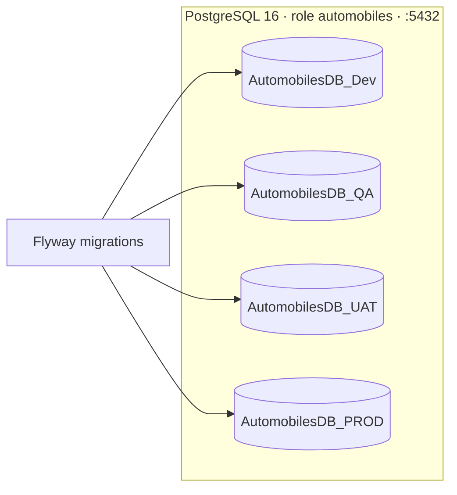

# AutoHub — Architecture Overview

AutoHub is a community platform for automobiles (cars & bikes) and travel. It combines
social posting, reviews & comments, a travel blog with a tour guide, community groups, and a
KYC-gated marketplace, plus an administrative control-panel with Masters, RBAC and user
management.

This document gives the system context, the monorepo layout, a high-level component diagram,
the technology stack, how the runtime components fit together, and the environment/database
topology.

## 1. System Context

AutoHub is delivered as **two React single-page applications** backed by a **single Spring Boot
backend** and a **PostgreSQL** database, with **Kafka** providing asynchronous event
distribution.

| Actor | Interacts with | Purpose |
|-------|----------------|---------|
| Public / Community user (Guest, Member, Buyer, Seller, Author) | `web-app` | Browse and create car/bike posts, reviews, comments, travel blogs, tours, community groups, marketplace listings. |
| Back-office user (Super Admin, Admin, Moderator) | `control-panel` | Manage Masters, RBAC, users, KYC approvals, moderation, reports, audit. |
| Both apps | `backend` REST API (`/api/v1/...`) | Single API surface secured with JWT + RBAC. |

## 2. Monorepo Layout

AutoHub is a single Git repository (monorepo) rooted at `E:\Anand\Projects\Automobiles`.

```
/README.md
/.gitignore
/.env.example
/docker-compose.yml
/Makefile
/db/init/01-init-databases.sql        # creates the four environment databases
/backend/                             # Spring Boot 3.3.x, Java 21, Clean Architecture
/web-app/                             # Vite + React 18 public/community app
/control-panel/                       # Vite + React 18 admin/back-office app
/docs/
  /product/        vision, personas, epics, user-stories, acceptance-criteria, test-cases, edge-cases, backlog
  /architecture/   overview, clean-architecture, event-driven-architecture, data-model-erd, api-contracts, rbac, security-kyc, /adr
  /agile/          sprint-plan, progress-tracker, definition-of-done
  /design/         design-system, ux-approach
```

Rationale for the monorepo is recorded in [ADR-0004](adr/0004-monorepo.md).

## 3. Component Diagram

```mermaid
flowchart TB
    subgraph Clients
        WA["web-app<br/>(React 18 + Bootstrap 5)<br/>dev :5173 / container :80"]
        CP["control-panel<br/>(React 18 + Bootstrap 5)<br/>dev :5174 / container :80"]
    end

    subgraph Backend["backend — Spring Boot 3.3.x / Java 21 (:8080)"]
        API["REST API /api/v1/**<br/>JWT + RBAC method security"]
        subgraph Contexts["Bounded Contexts (Clean Architecture)"]
            IDN[identity]
            CAT[catalog]
            MED[media]
            ENG[engagement]
            MKT[marketplace]
            TRV[travel]
            COM[community]
            ADM[adminops]
        end
        OBX["Outbox relay<br/>(polls outbox_events)"]
    end

    subgraph Data
        PG[("PostgreSQL 16<br/>:5432<br/>AutomobilesDB_*")]
        KAFKA["Apache Kafka (KRaft)<br/>:9092"]
    end

    ADMINER["Adminer<br/>:8081"]

    WA -->|HTTPS / axios| API
    CP -->|HTTPS / axios| API
    API --> Contexts
    Contexts -->|JPA| PG
    Contexts -->|write domain event + outbox row (same TX)| PG
    OBX -->|read unpublished rows| PG
    OBX -->|publish| KAFKA
    KAFKA -->|async consume| Contexts
    ADMINER -.-> PG
```

## 4. Technology Stack

| Layer | Technology | Version / Notes |
|-------|-----------|-----------------|
| Backend language | Java | 21 (LTS) |
| Backend framework | Spring Boot | 3.3.x |
| Build (backend) | Maven | Multi-module by bounded context |
| Architecture | Clean Architecture + Event-driven | Spring domain events + transactional Outbox + Kafka |
| Database | PostgreSQL | 16 |
| DB migrations | Flyway | Versioned SQL migrations |
| Messaging | Apache Kafka | KRaft mode, single broker |
| Frontend build | Vite | React 18 |
| Frontend UI | Bootstrap 5 + react-bootstrap | Both apps |
| Routing | react-router-dom | v6 |
| HTTP client | axios | Interceptors for JWT / refresh |
| Forms | react-hook-form | Validation |
| Rich text | react-quill | Post/blog body (sanitized server-side) |
| Media | 20-image uploader | JPEG/PNG/WEBP, ≤5 MB, ≥640x480 |
| DB UI | Adminer | :8081 |
| Containerization | Docker + Docker Compose | Local + CI |

Full rationale for these choices is recorded in [ADR-0001](adr/0001-tech-stack.md).

## 5. How the Components Fit Together

- **web-app** and **control-panel** are independent Vite/React builds. Both talk to the same
  `backend` REST API over HTTPS using axios. JWT access tokens are attached per request; a
  refresh token flow silently renews expired access tokens.
- **backend** is a single Spring Boot deployable, internally partitioned into eight bounded
  contexts (see [clean-architecture.md](clean-architecture.md)). It owns all business rules and
  is the only component with database credentials.
- **PostgreSQL** is the system of record. Each bounded context maps its aggregates via JPA. The
  schema is versioned with Flyway (see [ADR-0005](adr/0005-postgres-flyway.md)).
- **Kafka** carries domain events between contexts and enables eventual consistency. Events are
  never published directly from business transactions; they are first written to an
  `outbox_events` table in the same database transaction, then relayed to Kafka by the Outbox
  relay (see [event-driven-architecture.md](event-driven-architecture.md) and
  [ADR-0003](adr/0003-event-driven-outbox.md)).
- **Adminer** is a developer convenience for inspecting the database; it is not exposed in
  production.

### Request/event lifecycle (example: publishing a car post)

1. `web-app` `POST /api/v1/posts` with JWT (role permits `post:create`).
2. `catalog` application layer validates, persists the `posts` aggregate, and writes a
   `catalog.post.published` row into `outbox_events` in the **same transaction**.
3. The Outbox relay publishes that event to the Kafka topic `catalog.post.published`.
4. Interested consumers (e.g. `community` feed builder, `engagement` counters) react
   asynchronously and idempotently.

## 6. Environments & Databases

Four environments share the same schema (via Flyway) but use isolated databases on the same
PostgreSQL 16 instance. The owning role is `automobiles`.

| Environment | Purpose | Database | Notes |
|-------------|---------|----------|-------|
| Dev | Local development | `AutomobilesDB_Dev` | Default active DB for local dev. |
| QA | Automated + manual testing | `AutomobilesDB_QA` | CI test target. |
| UAT | User acceptance / staging | `AutomobilesDB_UAT` | Production-like data shape. |
| PROD | Production | `AutomobilesDB_PROD` | Secrets from a secrets manager. |



> **Secrets note:** The database password `Automobiles_DB@12345` is committed only for
> local/dev convenience, per project request. Production **must** source credentials from a
> secrets manager (e.g. Vault, AWS Secrets Manager) and must never use the committed value.
> See [security-kyc.md](security-kyc.md#secrets-handling).

## 7. Ports Reference

| Component | Dev port | Container port |
|-----------|----------|----------------|
| backend API | 8080 | 8080 |
| web-app | 5173 | 80 |
| control-panel | 5174 | 80 |
| PostgreSQL | 5432 | 5432 |
| Kafka | 9092 | 9092 |
| Adminer | 8081 | 8081 |

## Related Documents

- [clean-architecture.md](clean-architecture.md)
- [event-driven-architecture.md](event-driven-architecture.md)
- [data-model-erd.md](data-model-erd.md)
- [api-contracts.md](api-contracts.md)
- [rbac.md](rbac.md)
- [security-kyc.md](security-kyc.md)
- [Architecture Decision Records](adr/)
