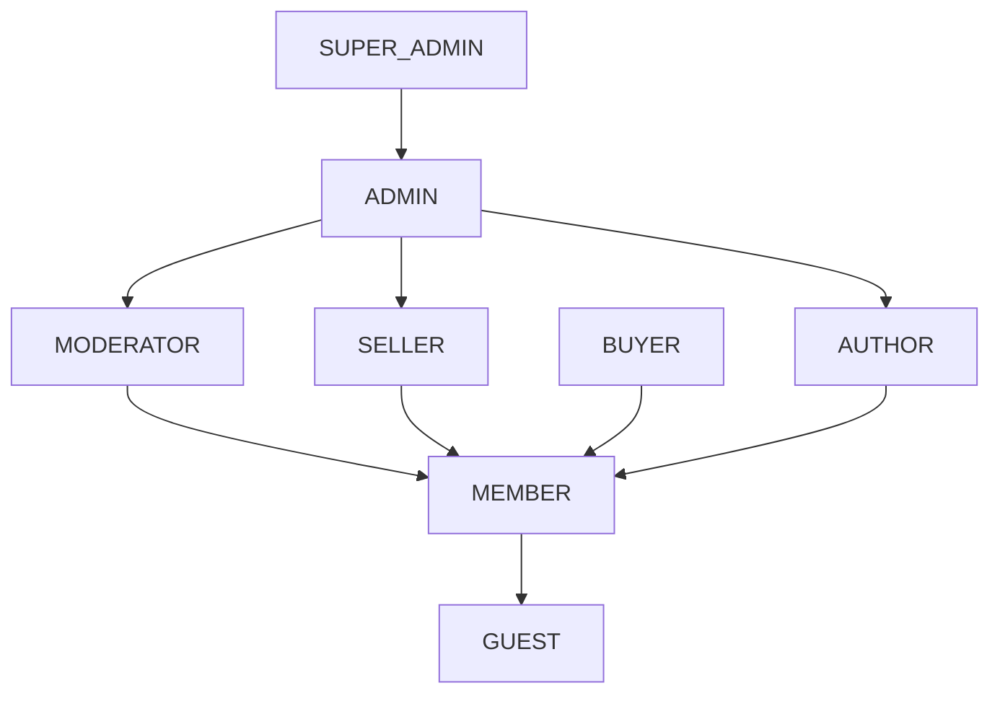

# Role-Based Access Control (RBAC)

AutoHub authorizes every protected operation with **role-based access control**. Users are
granted one or more **roles**; each role is granted a set of **permissions**; API endpoints and
service methods require specific permissions. This document defines the roles, the permission
model, the roles × permissions matrix, how enforcement works, the role hierarchy, and the mapping
of control-panel Masters to required permissions.

## 1. Roles (fixed)

| Role | Audience | Summary |
|------|----------|---------|
| `SUPER_ADMIN` | Platform owner | Full control including RBAC and Masters; can do anything. |
| `ADMIN` | Back-office | User management, Masters, moderation, KYC review. |
| `MODERATOR` | Back-office | Content moderation, reports, KYC review. |
| `SELLER` | Public | Create marketplace listings (requires APPROVED KYC). |
| `BUYER` | Public | Make offers on listings (requires KYC as applicable). |
| `AUTHOR` | Public | Author travel posts and tours. |
| `MEMBER` | Public | Signed-in baseline: create posts, reviews, comments, join communities. |
| `GUEST` | Public | Anonymous read-only access. |

## 2. Permission Model

Permissions are strings of the form **`resource:action`**. This keeps them self-describing and
groupable by resource.

Examples: `post:create`, `post:update`, `post:delete`, `listing:create`, `listing:approve`,
`review:create`, `comment:create`, `user:manage`, `master:manage`, `kyc:review`,
`moderate:content`, `report:resolve`, `travel:create`, `tour:create`, `offer:create`.

Naming rules:

- `resource` is a singular noun for the aggregate/area (`post`, `listing`, `user`, `master`,
  `kyc`, `review`, `comment`, `tour`, `travel`, `offer`, `report`, `moderate`).
- `action` is a verb (`create`, `read`, `update`, `delete`, `approve`, `review`, `manage`,
  `resolve`). `manage` implies full CRUD over the resource.

## 3. Roles × Permissions Matrix

Legend: ✓ = granted. `SUPER_ADMIN` holds all permissions implicitly.

| Permission | SUPER_ADMIN | ADMIN | MODERATOR | SELLER | BUYER | AUTHOR | MEMBER | GUEST |
|------------|:-----------:|:-----:|:---------:|:------:|:-----:|:------:|:------:|:-----:|
| `post:create` | ✓ | ✓ | ✓ | ✓ | ✓ | ✓ | ✓ | |
| `post:update` (own) | ✓ | ✓ | ✓ | ✓ | ✓ | ✓ | ✓ | |
| `post:delete` (own) | ✓ | ✓ | ✓ | ✓ | ✓ | ✓ | ✓ | |
| `review:create` | ✓ | ✓ | ✓ | ✓ | ✓ | ✓ | ✓ | |
| `comment:create` | ✓ | ✓ | ✓ | ✓ | ✓ | ✓ | ✓ | |
| `listing:create` | ✓ | ✓ | | ✓ | | | | |
| `listing:approve` | ✓ | ✓ | ✓ | | | | | |
| `offer:create` | ✓ | | | | ✓ | | | |
| `travel:create` | ✓ | ✓ | | | | ✓ | | |
| `tour:create` | ✓ | ✓ | | | | ✓ | | |
| `kyc:review` | ✓ | ✓ | ✓ | | | | | |
| `moderate:content` | ✓ | ✓ | ✓ | | | | | |
| `report:resolve` | ✓ | ✓ | ✓ | | | | | |
| `user:manage` | ✓ | ✓ | | | | | | |
| `master:manage` | ✓ | ✓ | | | | | | |
| `role:manage` | ✓ | | | | | | | |
| read (public content) | ✓ | ✓ | ✓ | ✓ | ✓ | ✓ | ✓ | ✓ |

Notes:

- "(own)" permissions additionally require an ownership check: the acting user must be the author
  (moderators/admins bypass ownership via `moderate:content`).
- `SELLER` can only exercise `listing:create` when the seller's `kyc_profiles.status = APPROVED`.
- `GUEST` is the anonymous baseline — read-only. Commenting requires at least `MEMBER`.

## 4. How RBAC Is Enforced

Enforcement is layered so that authorization is checked close to the code that performs the
action, not only at the edge.

1. **Authentication (JWT):** The client sends a Bearer **JWT access token**. A security filter
   validates the signature and expiry, loads the principal, and populates the security context
   with the user's granted authorities (roles as `ROLE_*` and permissions as their `resource:action`
   codes). See [security-kyc.md](security-kyc.md#authentication).
2. **Method security:** Service/use-case methods and controllers are annotated with declarative
   checks, e.g.:
   - `@PreAuthorize("hasAuthority('post:create')")`
   - `@PreAuthorize("hasAuthority('listing:approve')")`
   - Ownership: `@PreAuthorize("hasAuthority('post:update') and @postGuard.isOwner(#id, principal)")`
3. **Domain guards:** Ownership and state preconditions (e.g. SELLER KYC APPROVED before
   `listing:create`) are enforced in the application/domain layer, independent of the annotation,
   so they hold regardless of the entry point.
4. **Deny by default:** Endpoints without an explicit permission are denied to non-public roles;
   only endpoints explicitly marked `Public` are open to `GUEST`.

Because permissions (not roles) are checked at method level, adding or reorganizing roles does not
require touching endpoint code — only the `role_permissions` mapping changes.

## 5. Role Hierarchy

Roles are additive; higher roles include the capabilities of the roles they encompass.

The hierarchy is a conceptual model for reasoning about capability; enforcement is still by
explicit permission grants in `role_permissions`, so the effective rights of each role are exactly
those in the matrix above. `SUPER_ADMIN` additionally holds `role:manage` (RBAC self-administration),
which no other role has.

## 6. Control-Panel Masters → Required Permission

All Masters management requires `master:manage`, except RBAC entities (Role, Permission) which are
gated by the stricter `role:manage`. Read access to masters is public (used by the web-app forms).

| Master | Read | Create | Update | Delete |
|--------|------|--------|--------|--------|
| Vehicle Make | Public | `master:manage` | `master:manage` | `master:manage` |
| Vehicle Model | Public | `master:manage` | `master:manage` | `master:manage` |
| Vehicle Variant | Public | `master:manage` | `master:manage` | `master:manage` |
| Fuel Type | Public | `master:manage` | `master:manage` | `master:manage` |
| Body Type | Public | `master:manage` | `master:manage` | `master:manage` |
| Transmission | Public | `master:manage` | `master:manage` | `master:manage` |
| Category (car/bike) | Public | `master:manage` | `master:manage` | `master:manage` |
| Location / City | Public | `master:manage` | `master:manage` | `master:manage` |
| Currency | Public | `master:manage` | `master:manage` | `master:manage` |
| Tour Category | Public | `master:manage` | `master:manage` | `master:manage` |
| Review Tag | Public | `master:manage` | `master:manage` | `master:manage` |
| Report Reason | Public | `master:manage` | `master:manage` | `master:manage` |
| Role | `role:manage` | `role:manage` | `role:manage` | `role:manage` |
| Permission | `role:manage` | `role:manage` | `role:manage` | `role:manage` |

## Related Documents

- [security-kyc.md](security-kyc.md)
- [api-contracts.md](api-contracts.md)
- [data-model-erd.md](data-model-erd.md)
