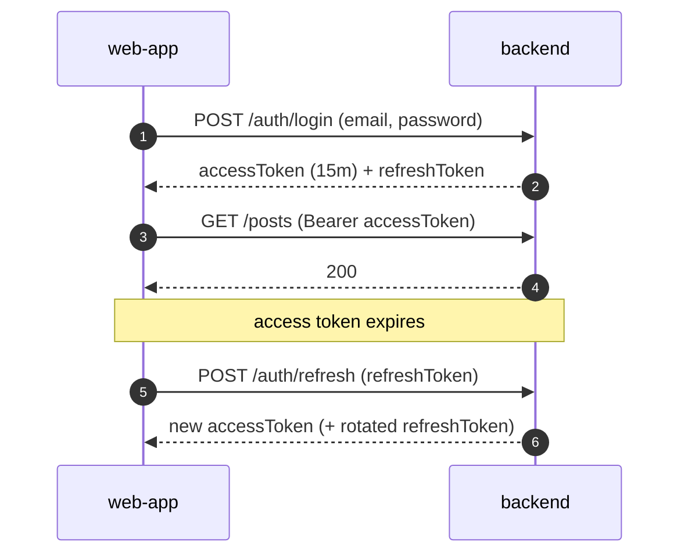
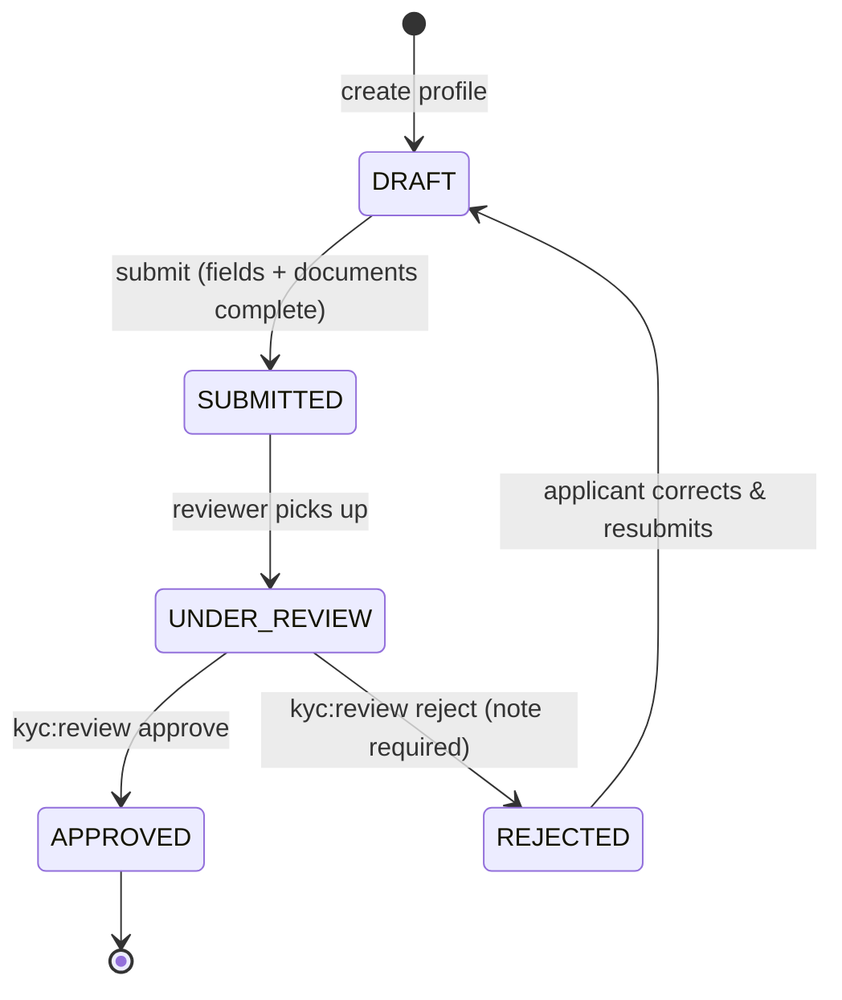

# Security & KYC

This document describes AutoHub's security architecture: authentication and token handling,
password storage, the signup-required-to-comment rule, the buyer/seller KYC flow and state
machine, rich-text sanitization, file-upload security, rate limiting, audit logging, and secrets
handling.

## 1. Authentication

AutoHub uses stateless **JWT** authentication with a short-lived access token and a longer-lived
refresh token.

- **Access token (JWT):** signed, short TTL (e.g. 15 minutes). Carries subject (`userId`), roles,
  and permission codes as claims. Sent as `Authorization: Bearer <token>`. Validated on every
  request by a security filter that populates the security context (see
  [rbac.md](rbac.md#how-rbac-is-enforced)).
- **Refresh token:** longer TTL (e.g. 7–30 days), opaque and stored server-side (revocable). Used
  only at `POST /api/v1/auth/refresh` to mint a new access token. Logout revokes it.
- **Rotation:** refresh tokens are rotated on use; a reused (already-rotated) token is treated as
  compromise and the token family is revoked.
- **Transport:** all traffic is HTTPS in QA/UAT/PROD. Tokens are never placed in URLs or query
  strings.

## 2. Password Hashing

- Passwords are hashed with **bcrypt** (adaptive work factor, per-password salt). Plaintext
  passwords are never stored or logged.
- Stored in `users.password_hash`. Verification uses a constant-time comparison.
- Password policy is enforced at signup (minimum length and complexity) and validated
  server-side, never trusting the client.

## 3. Signup-Required-to-Comment Rule

Reading content (posts, reviews, comments) is open to anonymous **GUEST** users. **Creating a
comment (or review) requires a signed-in account.**

- `POST /api/v1/posts/{postId}/comments` requires `comment:create`, which anonymous users do not
  hold — the request is rejected with `401 Unauthorized` (no token) or `403 Forbidden`
  (insufficient permission).
- The web-app surfaces this by prompting the visitor to sign up / log in before the comment box is
  usable, but the authoritative check is server-side.
- The same rule applies to reviews (`review:create`).

## 4. KYC Flow (Buyer & Seller)

KYC (Know Your Customer) gates trusted marketplace actions. Both buyers and sellers can hold a KYC
profile; a **seller must reach APPROVED** before creating listings.

### Review state machine

States: `DRAFT` → `SUBMITTED` → `UNDER_REVIEW` → `APPROVED` | `REJECTED`. A rejection carries a
reviewer note; the applicant may correct and resubmit (back to DRAFT/SUBMITTED).

### Required fields & documents

| KYC type | Required fields | Document types |
|----------|-----------------|----------------|
| Buyer | Legal name, contact phone, address, document number | Government photo ID (passport / national ID / driver's license) |
| Seller | Legal name, contact phone, address, document number, business/tax id (if trader) | Government photo ID **and** proof of ownership/business (for trader) |

Documents are uploaded via `POST /api/v1/kyc/{id}/documents` (multipart) and stored with the same
file-upload security controls as post images (§6). Approval emits a `KycApprovedEvent`, which the
identity consumer uses to grant the `SELLER` role — this is the saga described in
[event-driven-architecture.md](event-driven-architecture.md#saga-example--kyc-approval--seller-enabled).

## 5. Input Sanitization for Rich Text (XSS)

Post, review, travel and tour bodies are authored with **react-quill** and submitted as HTML
(`body_html`). Untrusted HTML is an XSS vector.

- **Server-side sanitization is authoritative.** On write, HTML is passed through an allow-list
  sanitizer (e.g. OWASP Java HTML Sanitizer / jsoup safelist) that permits only a safe subset of
  tags/attributes (basic formatting, links, images, lists) and strips `<script>`, event handlers
  (`onclick`, …), `javascript:` URLs, `style` with expressions, iframes, etc.
- Links are forced to safe schemes (`http`, `https`, `mailto`) and get `rel="noopener noreferrer"`.
- The sanitized HTML is what gets persisted; the raw client input is never stored or re-rendered.
- Output encoding is applied in the React apps as defense in depth (never `dangerouslySetInnerHTML`
  on unsanitized content).

## 6. File Upload Security

Applies to post images and KYC documents.

- **Type allow-list by content, not just extension:** JPEG, PNG, WEBP for images. The declared
  MIME and the actual sniffed magic bytes must match an allowed type; mismatches are rejected.
- **Size limit:** 5 MB per image (`413`/`422`). Request-level limits also cap the total multipart
  size.
- **Resolution:** images must be at least 640x480; recommended 1280x720+.
- **Count limit:** at most 20 images per post, enforced in the DTO validator and the domain
  aggregate.
- Uploaded files are stored under **server-generated keys** (not user-supplied filenames), with
  the original name discarded/normalized to avoid path traversal.
- Files are served from a separate origin/bucket with restrictive content-type and
  `Content-Disposition` headers; images are never executed.
- KYC documents are stored in a **private** location, accessible only to the owner and users with
  `kyc:review`.

Detailed image rules and error contract: [api-contracts.md](api-contracts.md#image-upload-media--multipart).

## 7. Rate Limiting

- Sensitive endpoints (`/auth/login`, `/auth/signup`, `/auth/refresh`, password reset) are rate-
  limited per IP and per account to slow brute-force and credential-stuffing attacks; exceeding
  the limit returns `429 Too Many Requests`.
- Write-heavy endpoints (post/comment/review/upload creation) have per-user throttles to curb
  spam and abuse.
- Repeated auth failures trigger progressive backoff / temporary lockout, recorded in the audit
  log.

## 8. Audit Logging

- Security-relevant and administrative actions are recorded in `audit_log`: login success/failure,
  role grants/revocations, KYC decisions, listing approvals, Masters changes, content moderation,
  and report resolutions.
- Each entry captures actor, action, target entity type/id, JSON details, source IP, and
  timestamp (see [data-model-erd.md](data-model-erd.md#platform--cross-cutting)).
- The audit log is append-only (no updates/deletes through the application) and is a key input to
  incident investigation.

## 9. Secrets Handling

- The development database password `Automobiles_DB@12345` (role `automobiles`) is **committed only
  for local/dev convenience**, per project request, so that `docker-compose` and local runs work
  out of the box against `AutomobilesDB_Dev`.
- **Production must not use the committed value.** In QA/UAT/PROD, database credentials, JWT signing
  keys, and any third-party secrets must be sourced from a **secrets manager** (e.g. HashiCorp
  Vault, AWS Secrets Manager, or environment-injected secrets from the orchestrator) and rotated
  regularly. The committed dev password must be replaced before any non-local deployment.
- JWT signing keys are environment-specific and never committed. `.env.example` documents the
  required variables without real values.

## Related Documents

- [rbac.md](rbac.md)
- [api-contracts.md](api-contracts.md)
- [event-driven-architecture.md](event-driven-architecture.md)
- [overview.md](overview.md#6-environments--databases)
