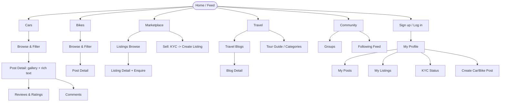
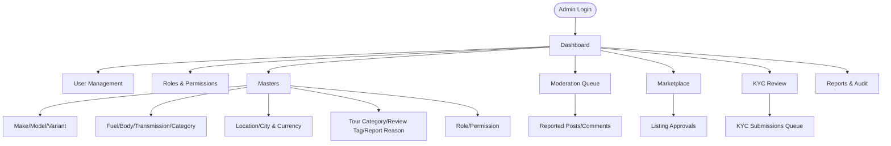
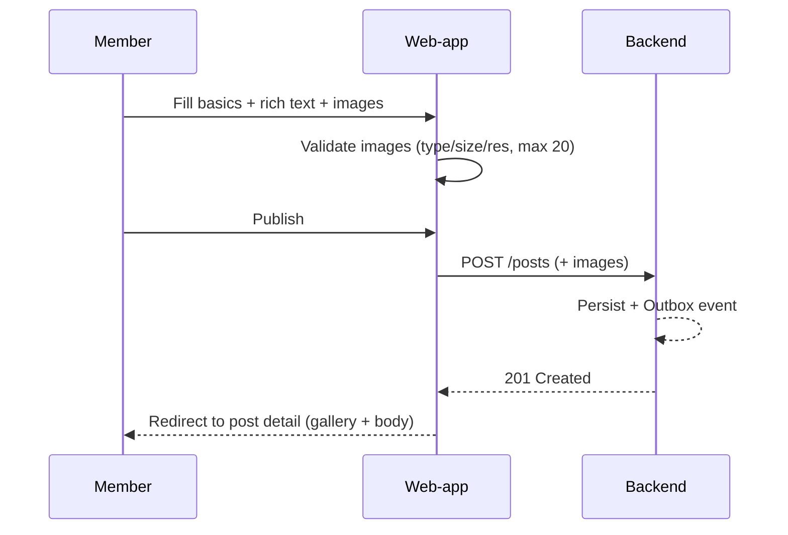
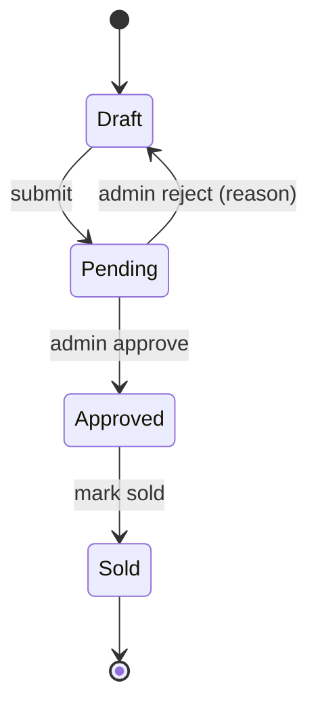

# AutoHub — UX Approach & Information Architecture

> How users move through **web-app** (public/community) and **control-panel** (admin/back-office). Companion to the [Design System](./design-system.md). Scope & features fixed by [`CANONICAL_SPEC.md`](../../CANONICAL_SPEC.md).

---

## 1. UX Principles

| Principle | What it means for AutoHub |
| --- | --- |
| **Content-first** | Vehicle imagery and stories lead; chrome recedes. |
| **Progressive disclosure** | Show essentials; reveal advanced filters, KYC, moderation on demand. |
| **Trust & clarity** | KYC status, roles, verified badges, and prices always legible. |
| **Consistency across apps** | One design system; web-app immersive, control-panel dense. |
| **Guided, forgiving flows** | Multi-step tasks (car post, KYC) autosave, validate inline, allow back-navigation. |
| **Accessible by default** | Keyboard, contrast, and screen-reader support are baseline, not polish. |

Primary personas: **Enthusiast/Member** (browse, review, comment), **Author** (travel blogs, tours), **Seller** (KYC + listings), **Buyer** (browse marketplace, enquire), **Moderator/Admin** (control-panel).

---

## 2. Information Architecture — Sitemaps

### Web-app (public / community)

### Control-panel (admin / back-office)

---

## 3. Key User Flows

### 3.1 Signup → Comment

1. Guest opens a car post detail page; comment box prompts "Log in to join the conversation."
2. Clicks **Sign up** → registration form (name, email, password; policy hints inline).
3. Submits → account created (`identity.user.registered` event); role `MEMBER` assigned; verification/onboarding toast.
4. Returns to the post (deep-link preserved); the comment box is now enabled.
5. Writes a comment → inline validation (non-empty, length) → submits.
6. Comment appears optimistically with author avatar & timestamp; edit/delete available on own comment.

### 3.2 Create a car post with 20 images + rich text

1. Logged-in Member → **Create Post** (guarded route; requires auth).
2. **Step 1 — Basics:** select Category (car/bike), Make → Model → Variant (dependent selects from Masters), Fuel/Body/Transmission, title.
3. **Step 2 — Story:** write body in **react-quill** rich editor (headings, lists, links, inline images); autosaves draft.
4. **Step 3 — Images:** drag-drop up to **20** images. Each validated client + server side: JPEG/PNG/WEBP, ≤5 MB, ≥640×480. Invalid files rejected with a clear per-file message; per-image alt text captured; drag to reorder; first image = cover.
5. **Step 4 — Review & publish:** preview card + gallery; publish → `catalog.post.published` + `media.image.uploaded` events; redirect to the new post detail.

### 3.3 Seller KYC

1. Member chooses **Sell** → gated: "Complete KYC to list vehicles."
2. KYC form: identity details + document upload (ID, address proof) with validation & privacy notice.
3. Submit → status **Pending** (badge visible on profile); admin notified.
4. Moderator/Admin opens **KYC Review** queue (control-panel), inspects docs, **Approve** or **Reject** with reason (`kyc:review`).
5. Approve → user gains `SELLER` role + KYC **Verified** badge; can now create listings. Reject → reason shown; user may resubmit.

### 3.4 Buy / Sell listing

**Sell:** (KYC-verified) → Create Listing: pick vehicle attributes (Masters), price + Currency, description, images → submit as **Pending** → admin **Listing Approval** → **Approved/Published** → visible in Marketplace. Lifecycle: `draft → pending → approved → sold`.

**Buy:** Buyer browses Marketplace with filters (make/model/price/location) → opens Listing Detail → **Enquire** (contact seller / message) → optionally follows listing; buyer KYC may be required to enquire on high-value listings.

### 3.5 Publish travel blog

1. Author → **Travel → Write Blog** (requires `AUTHOR`/eligible role).
2. Compose in react-quill; choose Tour Category (Master); add cover + inline images (same media rules).
3. Optionally attach a tour-guide itinerary (stops, locations from Masters).
4. Preview → **Publish** → appears in Travel blog list & following feeds.

---

## 4. Wireframe Descriptions (textual)

### Web-app — Home / Feed
- **Top:** sticky navbar (brand, primary nav, search, auth/profile, theme toggle).
- **Hero:** rotating featured posts / marketplace highlights (large imagery, amber CTA).
- **Body:** responsive card grid — mixed feed of latest car/bike posts, top listings, travel blogs; each card shows cover image, title, make/model badges, rating, author/meta.
- **Sidebar (≥lg):** trending makes, popular tours, "Start selling" CTA.
- **Footer:** pillars, about, legal, theme note.

### Web-app — Post Detail
- Breadcrumb → **H1 title** + author/meta + role badge.
- **Image gallery** (cover + thumbnail strip, lightbox) up to 20 images.
- **Rich-text body** (max ~68ch measure).
- **Specs panel** (Make/Model/Variant/Fuel/Body/Transmission) as a compact table.
- **Reviews** (rating summary + list) and **Comments** (threaded, inline compose).
- Sticky "Report" affordance.

### Web-app — Create Post (wizard)
- 4-step progress indicator (Basics → Story → Images → Review).
- Left: form fields; right: live preview card. Autosave indicator. Sticky Back/Next/Publish bar.

### Web-app — Marketplace Listing Detail
- Gallery + price (with Currency) prominent, KYC-verified seller badge, specs, description.
- Primary **Enquire** button; secondary **Follow**; seller card with response info.

### Control-panel — Dashboard
- Left collapsible sidebar (Masters, Users, RBAC, Moderation, Marketplace, KYC, Reports).
- Top bar: breadcrumb, global search, admin menu, theme toggle.
- Body: KPI stat cards (pending KYC, pending listings, open reports, new users) + recent-activity table.

### Control-panel — Masters / Users / Queues (data-table pattern)
- Page header + primary action (e.g., **+ New Make**).
- Filter/search row; **data table** (sortable, paginated, sticky header, row actions, density toggle).
- Row → side drawer or modal for create/edit with validated form.
- Moderation & approval queues use the same table with status badges + Approve/Reject actions and reason capture.

---

## 5. Responsive / Mobile Approach

Mobile-first, Bootstrap 5 grid & breakpoints.

| Breakpoint | Width | Behavior |
| --- | --- | --- |
| `xs` <576 | phone | Single column; navbar collapses to hamburger; bottom-anchored primary actions; galleries swipe. |
| `sm` ≥576 | large phone | 2-col card grid. |
| `md` ≥768 | tablet | 2–3 col grid; control-panel sidebar collapses to icons. |
| `lg` ≥992 | laptop | Full sidebar/rail; 3-col web-app grid; data tables show all columns. |
| `xl/xxl` ≥1200 | desktop | Max content width ~1200–1320px; sidebars visible. |

- **Web-app:** immersive imagery scales with `srcset`; wizards become full-screen stepped panels on mobile.
- **Control-panel:** data tables switch to stacked "card rows" or horizontal scroll on small screens; primary filters collapse into a sheet.
- Touch targets ≥44px; sticky action bars keep primary CTA reachable.

---

## 6. Empty, Loading, and Error States

Every list/detail/form defines all three states — required for a screen to be "done".

### Loading
- **Skeletons** for cards, tables, galleries, and detail panels (never a bare spinner where layout is known).
- Buttons show inline spinner + `aria-busy` during submit; disable to prevent double-submit.
- Perceived-performance: optimistic UI for comments/reviews; progressive image loading.

### Empty
- Illustrative panel + one-line explanation + primary action.
- Examples: *No posts yet → "Be the first to post a ride" → Create Post*; *No listings match filters → "Clear filters"*; *KYC not started → "Verify to start selling"*; *Empty moderation queue → "All clear — nothing to review."*

### Error
- **Field-level:** inline message + icon + red border; `aria-describedby` links input to error; error summary at top of long forms.
- **Page-level:** friendly message, cause (where safe), and recovery action (retry / go back). Never expose stack traces.
- **Validation (media):** per-file reasons — "Unsupported type (use JPEG/PNG/WEBP)", "Too large (max 5 MB)", "Resolution too low (min 640×480)", "Limit is 20 images".
- **Permission:** 403 states explain the missing role/permission and link to request access or KYC where relevant.
- **Network/offline:** non-blocking toast + retry; autosaved drafts preserved.

---

## 7. Navigation & Cross-links

- Deep links preserved through auth (return-to after login).
- Breadcrumbs on all control-panel pages and deep web-app pages.
- Role- and KYC-aware navigation: actions the user cannot perform are hidden or shown with a clear "unlock" path rather than dead-ends.
- Consistent placement: primary action top-right (desktop) / bottom-sticky (mobile); destructive actions require confirmation.
